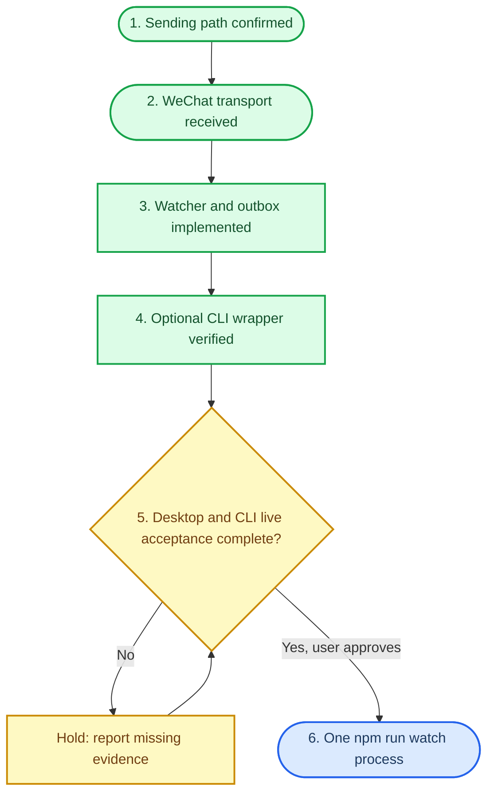

# Codex / Claude 交接

## 接手前结论

当前仓库已完成真实微信运输验证，并完成一项“新建 CLI 任务正常结束”的四层端到端验收，但尚未完成全部生产验收。下一位代理的默认动作是保留现状、阅读本文件、[实施计划](implementation-plan.md) 和 [现场验收记录](live-acceptance.md)，而不是启动服务或改写系统配置。

运行时基线提交如下：

| 提交 | 作用 | 验证状态 |
| --- | --- | --- |
| `d734a68` | 初始化本地通知桥 | 历史基线 |
| `bf98bec` | OpenClaw watcher 通知与真实 adapter | 软件实现完成 |
| `d2d20a9` | 刷新 GitNexus 索引元数据 | 索引与运行时代码对齐 |
| `ced6bdc` | CLI wrapper stderr 透传测试 | `npm run check` 与 `npm test` 通过，24/24 |
| `6edcbea` | 保持无 HTTP listener 的 watcher 进程存活 | 回归测试通过 |
| `a24bef4` | 通过 PowerShell shim 安全执行 Windows OpenClaw | 26/26；本机真实命令退出码为 0 |
| `071b203` | 刷新 GitNexus 生成文档 | 索引生成文件对齐 |
| `373fd3d` | 通知附带净化后的最终 assistant 输出 | `npm run check` 与 `npm test` 通过，30/30；尚未做新增输出段的真实微信显示确认 |

## 阶段门禁

阶段 1 和 2 已完成。阶段 3 和 4 只达到“实现和软件验证”。阶段 5 被真实 Desktop API 错误的安全可控触发方式阻塞，阶段 6 尚未开始。不能跨过图中的判定节点。

## 证据分类

| 标签 | 当前已知事实 | 不能推出的结论 |
| --- | --- | --- |
| 实现完成 | watcher、outbox、OpenClaw adapter、可选 wrapper 都在代码中 | 不代表已运行或已向微信送达 |
| 软件验证 | `npm run check` 和 `npm test` 均通过，测试数为 31 | 不代表真实 Codex 或微信现场行为 |
| 运输验证 | 一次真实 `openclaw message send` 成功退出，且收件人确认微信实际收到 | 不代表 Codex 终态被捕获 |
| 现场验收 | CLI 正常完成用例已通过四层证据 | 只证明该用例，不代表全部生产验收完成 |

已验证的 transport contract 只记录在 [发送契约](verified-openclaw-contract.md)。该契约的 account 和完整 target 从安全环境变量读取；绝不读取或把值写入代码、文档、Git、日志或聊天。

## 最终输出字段

`373fd3d` 扩展了原先的元数据通知：watcher 只读取当前根任务最后一条 assistant `output_text`，可选 CLI wrapper 只读取最后一个 `item.completed` 的 `agent_message`。`createEvent` 在任何 outbox 或 adapter 处理前统一移除控制字符、遮盖明显的认证头、Cookie、token、API key、密码和 secret，并截断到 1200 个字符；格式化时仅在非空时追加“输出”段。

这项扩展不允许提取、持久化或投递用户 prompt、用户消息、完整会话、原始 API 请求/响应或原始错误正文。API 失败或中断没有 assistant 结果时，输出段应缺省。2026-07-28 已通过的 CLI 正常完成验收发生在该提交之前，所以只能证明终态运输链路，不能证明新增输出段已在微信端显示。

## 轻量一键入口

仓库提供 `configure-notifier.cmd`、`start-notifier.cmd`、`notifier-status.cmd` 和 `stop-notifier.cmd`。首次配置由 Windows DPAPI 保护 account/target；后续启动不要求用户再次注入。实现只启动一个隐藏的 `node src/index.mjs watch`，复用现有 OpenClaw CLI 与 Gateway，不经过 npm，不新增 Gateway、HTTP listener、服务、计划任务或代理。运行目录固定隔离到 `%LOCALAPPDATA%\CodexOpenClawNotifier\live`，禁止为“清理”而删除旧默认 outbox。

一键入口已做软件级启动、重复启动、状态、停止和敏感值不出现在输出中的测试，但没有自动启动真实生产 watcher。接手代理不得把脚本存在或测试通过写成微信现场验收完成。

## OpenClaw 路径

现有 OpenClaw CLI 是唯一有本机证据支持的发送路径。插件被加载、一个既有账号被深度状态报告为运行中，`send` 能力和发送 CLI 参数均已核对。`default` channel 配置不等于已运行且可发送的账号。完整目标来自实际入站元数据，peer-only target 会失败。

Codeg 仅提供 iLink 轮询相关迹象，未得到可安全复用的公开发送命令和收件人契约。不要猜测或重用其协议，也不要为此读取任何凭据。

## 阶段 5 的阻塞与验收矩阵

禁止为了制造 Desktop API 错误而改变 Desktop 配置、认证、网络、`base_url` 或代理。若用户暂时无法操作真实 Desktop，会话应停在阶段 5 并交接这个阻塞，而不是启动生产 watcher。

| 用例 | 事件捕获 | outbox 入队 | 发送命令成功 | 微信实际收到 | 当前状态 |
| --- | --- | --- | --- | --- | --- |
| Desktop 正常完成 | 必需 | 必需 | 必需 | 必需 | 未验收 |
| Desktop API 错误 | 必需 | 必需 | 必需 | 必需 | 阻塞 |
| CLI 正常完成 | 已证明 | 已证明 | 已证明 | 已证明 | 通过：2026-07-28 |
| CLI 非零/API 错误 | 必需 | 必需 | 必需 | 必需 | 未验收 |
| 用户中断 | 必需 | 必需 | 必需 | 必需 | 未验收 |
| 微信离线后恢复 | 必需 | 必需 | 必需 | 必需 | 未验收 |

`dry-run`、测试绿灯、Gateway 可达、端口监听、channel configured/enabled 或只有发送命令退出码 0，均不能填补“微信实际收到”列。

CLI 正常完成用例的无敏感证据、时间和验证目录边界记录在 [现场验收记录](live-acceptance.md)。该用例使用临时 watcher，验收结束后已停止；没有注册服务、计划任务或修改 Codex 配置。

## 禁止事项

- 不删除、重建、重新登录、重新扫码或重复创建现有 OpenClaw、Gateway、Gateway 计划任务和两个微信 channel。
- 不读取、输出、提交或索要 token、cookie、二维码、account、完整 target、用户 prompt、用户消息、完整会话、源码或原始请求/响应正文。只有净化、截断后的最后一条 assistant 输出可以进入通知。
- 不改 `C:\Users\TheMapleBin\.codex\config.toml`，不改 `base_url`，不启用 `15722`，不新增计划任务或服务。
- 不启用 Stop hook、API proxy 或 CLI wrapper 作为生产路径；wrapper 只在 watcher 不能提供精确 CLI 退出码时按需验证。
- 不在阶段 5 之前运行常驻 watcher；不在阶段 6 之外注册任何通知服务。
- 不进行微信账号、Gateway、代理或生成文件清理，除非用户先批准列出的对象和影响。

## 接手工作方式

1. 先运行 `git status --short`，阅读相关 diff，保护脏工作树。
2. 对代码符号使用 GitNexus 先做 impact；文档调整后仍在提交前运行 `detect_changes`。
3. 对阶段 5 的每一项，先报告上表中已掌握的证据，再进行最小允许动作；失败时报告缺少哪一列，不要绕过门禁。
4. 修改文件后运行 `git diff --check`、`npm run check`、`npm test`，只暂存本任务路径、本地提交且不 push。
5. 提交后刷新并核对 GitNexus 索引。若分析器更新生成区块，审计该变更并单独提交或与同一范围的文档提交一并提交。

本文件与根目录的 `AGENTS.md`、`CLAUDE.md` 是后续代理的安全约束入口。二者如与旧文档冲突，以本文件和实施计划的阶段门禁为准。
